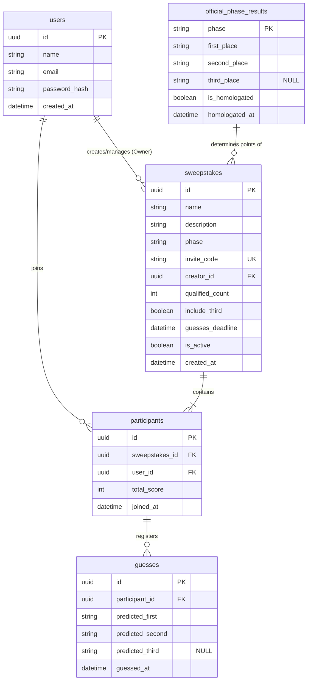

## Modelo Entidade-Relacionamento (DER / Banco de Dados)

O banco de dados relacional (PostgreSQL) é modelado para gerenciar usuários, bolões, membros e palpites baseados em previsões de classificação de fases.

