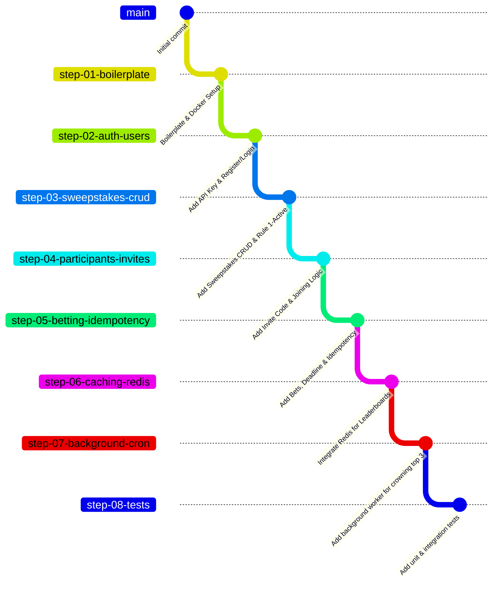

## Diagrama de Branches Git (Roadmap do Aluno)

Abaixo está o fluxo linear de branches que os alunos seguirão para construir a aplicação incrementalmente.

```mermaid
gitGraph
    commit id: "Initial commit"
    branch step-01-boilerplate
    checkout step-01-boilerplate
    commit id: "Boilerplate & Docker Setup"
    branch step-02-auth-users
    checkout step-02-auth-users
    commit id: "Add API Key & Register/Login"
    branch step-03-sweepstakes-crud
    checkout step-03-sweepstakes-crud
    commit id: "Add Sweepstakes CRUD & Rule 1-Active"
    branch step-04-participants-invites
    checkout step-04-participants-invites
    commit id: "Add Invite Code & Joining Logic"
    branch step-05-betting-idempotency
    checkout step-05-betting-idempotency
    commit id: "Add Bets, Deadline & Idempotency"
    branch step-06-caching-redis
    checkout step-06-caching-redis
    commit id: "Integrate Redis for Leaderboards"
    branch step-07-background-cron
    checkout step-07-background-cron
    commit id: "Add background worker for crowning top 3"
    branch step-08-tests
    checkout step-08-tests
    commit id: "Add unit & integration tests"
```