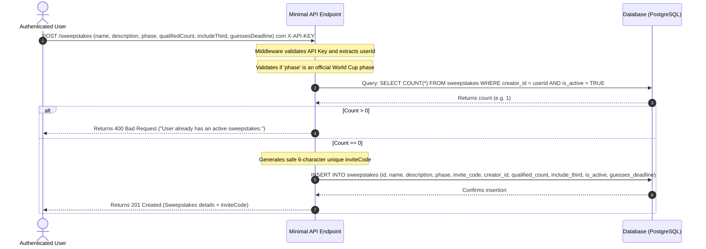

## Diagrama de Sequência: Criar Bolão (Regra de Negócio)

Verifica a regra de que o criador só pode possuir **um bolão ativo** por vez e armazena as configurações da fase.

```mermaid
sequenceDiagram
    autonumber
    actor Owner as Authenticated User
    participant API as Minimal API Endpoint
    participant DB as Database (PostgreSQL)

    Owner->>API: POST /sweepstakes (name, description, phase, qualifiedCount, includeThird, guessesDeadline) com X-API-KEY
    Note over API: Middleware validates API Key and extracts userId
    Note over API: Validates if 'phase' is an official World Cup phase
    API->>DB: Query: SELECT COUNT(*) FROM sweepstakes WHERE creator_id = userId AND is_active = TRUE
    DB-->>API: Returns count (e.g. 1)
    alt Count > 0
        API-->>Owner: Returns 400 Bad Request ("User already has an active sweepstakes.")
    else Count == 0
        Note over API: Generates safe 6-character unique inviteCode
        API->>DB: INSERT INTO sweepstakes (id, name, description, phase, invite_code, creator_id, qualified_count, include_third, is_active, guesses_deadline)
        DB-->>API: Confirms insertion
        API-->>Owner: Returns 201 Created (Sweepstakes details + inviteCode)
    end
```