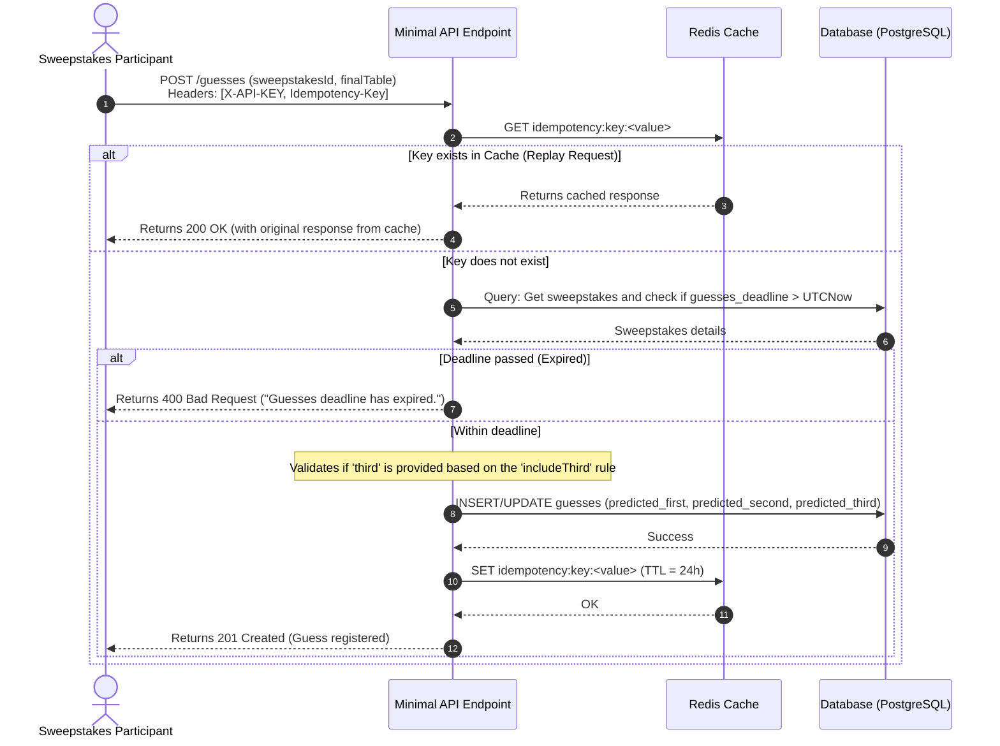

## Diagrama de Sequência: Registrar Palpite (Idempotência e Deadline)

Ilustra o uso do cabeçalho `Idempotency-Key` e a validação do prazo final para palpites baseados em tabelas de classificação de fases.

