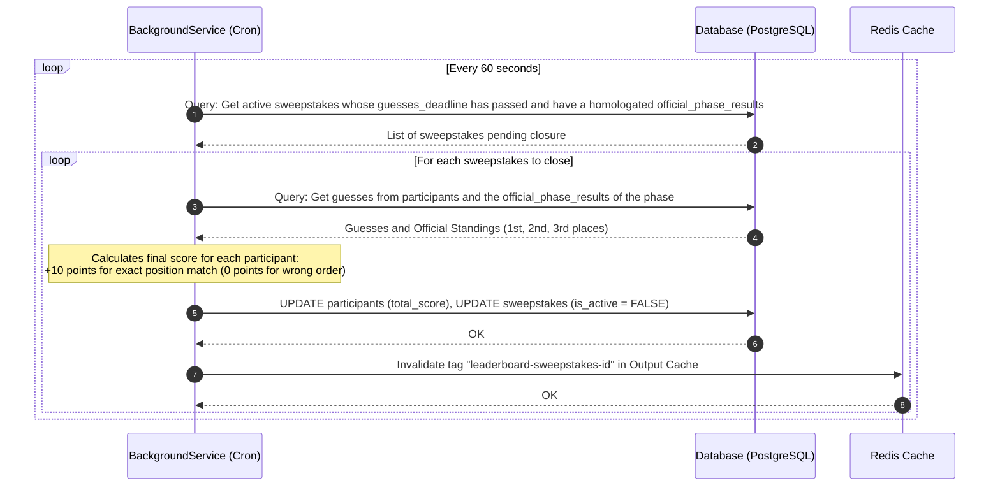

## Diagrama de Sequência: Worker de Encerramento (Background Worker)

O worker roda em segundo plano para consolidar as pontuações assim que os resultados oficiais das fases são homologados.

```mermaid
sequenceDiagram
    autonumber
    participant Worker as BackgroundService (Cron)
    participant DB as Database (PostgreSQL)
    participant Cache as Redis Cache

    loop Every 60 seconds
        Worker->>DB: Query: Get active sweepstakes whose guesses_deadline has passed and have a homologated official_phase_results
        DB-->>Worker: List of sweepstakes pending closure
        loop For each sweepstakes to close
            Worker->>DB: Query: Get guesses from participants and the official_phase_results of the phase
            DB-->>Worker: Guesses and Official Standings (1st, 2nd, 3rd places)
            Note over Worker: Calculates final score for each participant:<br/>+10 points for exact position match (0 points for wrong order)
            Worker->>DB: UPDATE participants (total_score), UPDATE sweepstakes (is_active = FALSE)
            DB-->>Worker: OK
            Worker->>Cache: Invalidate tag "leaderboard-sweepstakes-id" in Output Cache
            Cache-->>Worker: OK
        end
    end
```